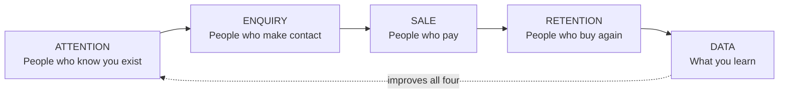

The standard Kenyan SME digital growth story goes like this. Sales are flat, so the business decides it needs to be "more visible online". It pays somebody to run social media, maybe rebuilds the website, maybe boosts some posts. Traffic goes up. Followers go up. Revenue does not move. Six months later the conclusion is that digital marketing does not work for this kind of business.

The diagnosis is almost always wrong. Digital marketing worked exactly as purchased: it bought attention. What the business never established was whether attention was the thing it was short of. In most of the cases I see, it was not. The website was getting visitors who could not find a way to enquire. Or enquiries were arriving on WhatsApp and being answered eleven hours later. Or the sale was closing and the customer never bought again. Attention was the only link in the chain anybody measured, so attention was the only link anybody bought.

Growth is a chain of five links: **attention, enquiry, sale, retention, and the data loop that improves all four.** Money spent on any link upstream of a break is wasted, and the break is usually not where the business assumes.

This guide is the pillar hub for that chain. It is the map that places every deep-dive in the cluster: [SEO and inbound](/blog/sme-seo-inbound-lead-engine) for attention, [why your website gets traffic but zero enquiries](/blog/website-traffic-zero-enquiries) for conversion, [WhatsApp as a sales channel](/blog/whatsapp-sales-channel-kenya) and [ecommerce storefront conversion](/blog/ecommerce-storefront-conversion-launch) for the sale, [customer avatars](/blog/archive-customer-avatars-buyer-persona) for who you are talking to, and [the retail decision dashboard](/blog/retail-data-decision-dashboard) and [data-driven inventory](/blog/data-driven-inventory-small-shops-kenya) for the loop. What the hub owns is the diagnosis, the arithmetic, and the order of operations.

> **Key Insight:** Every business has exactly one binding constraint at a time, and spending on any other link produces nothing. A business converting 1% of website visitors into enquiries does not have a traffic problem; doubling traffic doubles the waste. Find the weakest link by measuring the chain end to end, fix that link, then re-measure, because fixing it will move the constraint somewhere else. Digital growth is not a campaign. It is a sequence of constraint removals, and the sequence matters more than the tools.

```cards
- icon: Link
  title: Five links, one chain
  desc: Attention, enquiry, sale, retention, data. Money spent upstream of a broken link is wasted, and the break is rarely where you assume.
- icon: Percent
  title: Do the arithmetic first
  desc: Traffic times conversion times order value times repeat rate is your revenue. Know all four numbers before buying more of the first.
  type: amber
- icon: MapPin
  title: Local search is the cheap win
  desc: A complete Google Business Profile with real reviews outranks paid attention for buying-intent searches, and it costs nothing but attention to detail.
  linkText: The SEO economics
  linkUrl: /blog/sme-seo-inbound-lead-engine
  type: emerald
```

---

### Part 1: The Chain



Each link has one job, one common failure, and one owner in the library.

| Link | Job | Common failure | Deep-dive |
|---|---|---|---|
| **Attention** | Be findable by people with the problem you solve | Buying reach from people who will never buy | [SEO and inbound](/blog/sme-seo-inbound-lead-engine) |
| **Enquiry** | Make contact effortless and obvious | A site that describes the business instead of the visitor's problem | [Traffic but zero enquiries](/blog/website-traffic-zero-enquiries) |
| **Sale** | Answer fast, quote clearly, take payment cleanly | Slow replies; a checkout that does not match how Kenyans pay | [WhatsApp](/blog/whatsapp-sales-channel-kenya), [ecommerce conversion](/blog/ecommerce-storefront-conversion-launch) |
| **Retention** | Make the second purchase easier than the first | No record of who bought what, so no reason to return | [Decision dashboard](/blog/retail-data-decision-dashboard) |
| **Data** | Know which of the above is actually broken | Measuring followers instead of enquiries | [Data-driven inventory](/blog/data-driven-inventory-small-shops-kenya) |

The discipline is to measure all five before spending on any one. That is the whole of Part 2.

---

### Part 2: The Arithmetic

Revenue from a digital channel is a product, not a sum:

$$
\text{Revenue} = \text{Visitors} \times \text{Conversion rate} \times \text{Average order value} \times \text{Purchases per customer}
$$

Because it is a product, **a weak term cannot be compensated by strengthening a different one cheaply**. Doubling visitors at a 1% conversion rate is far more expensive than lifting conversion from 1% to 2%, and produces the same result.

Run it on a real shape. A Kenyan retailer with a website:

| Term | Current | Notes |
|---|---:|---|
| Monthly visitors | 4,000 | |
| Conversion to order | 1.1% | 44 new customers |
| Average order value | KES 3,500 | |
| First-purchase revenue | KES 154,000 | 44 × 3,500 |
| Purchases per customer | 1.2 | |
| **Monthly revenue** | **KES 184,800** | |

Now compare three interventions:

**Option A: double the traffic to 8,000.** Revenue becomes **KES 369,600**. Requires sustained paid spend or a year of content work, and stops the moment the spend stops.

**Option B: lift conversion from 1.1% to 3.4%.** Revenue becomes **KES 571,200**, a tripling, from the same traffic. Requires clearer messaging, a visible contact path and a checkout that works, which is largely a one-off fix that keeps paying. That 1.1% to 3.4% movement is not hypothetical; it is the documented result in [the ecommerce storefront conversion case](/blog/ecommerce-storefront-conversion-launch).

**Option C: lift repeat purchases from 1.2 to 2.0.** Revenue becomes **KES 308,000**, up two thirds, and it costs almost nothing but a customer record and a reason to come back.

Option A is what most SMEs buy. Options B and C are cheaper, more durable, and almost always available first.

#### The Two Numbers That Decide Whether a Channel Works

$$
\text{CAC} = \frac{\text{Total spend on the channel}}{\text{New customers it produced}}
\qquad
\text{LTV} = \text{AOV} \times \text{Gross margin} \times \text{Purchases per customer}
$$

If **LTV is not comfortably above CAC**, the channel is not a growth channel; it is a subsidy. On the retailer above, at a 35% gross margin and 1.2 purchases a year, lifetime value is roughly KES 1,470. Any acquisition channel costing more than about KES 500 per customer is marginal, and one costing KES 1,500 is destroying money at scale.

This is also the point at which digital growth becomes a finance conversation rather than a marketing one, because the same margin discipline applies here as in [SME financial ratios](/blog/sme-financial-ratios-kenya) and the same cash timing questions arise as in [the 13-week cash forecast](/blog/13-week-cash-forecast-kenya-sme). Paid acquisition is spend today for revenue later, which is a working-capital decision wearing a marketing budget.

---

### Part 3: Diagnose Before You Spend

Use the symptom to find the broken link.

| What you observe | The broken link | What to fix |
|---|---|---|
| Nobody has heard of us; no search traffic | Attention | Local search first, then content. See [SEO and inbound](/blog/sme-seo-inbound-lead-engine) |
| Traffic is fine, nobody contacts us | Enquiry | Messaging and contact friction. See [traffic but zero enquiries](/blog/website-traffic-zero-enquiries) |
| Plenty of enquiries, few orders | Sale | Response time, quoting, payment path. See [WhatsApp](/blog/whatsapp-sales-channel-kenya) |
| Orders come, customers never return | Retention | Customer records and follow-up |
| We cannot tell which of the above is true | Data | Measurement, before anything else |
| Busy but not profitable | None of the above | This is a margin problem, not a growth problem |

That last row matters. A business with a broken unit economic does not have a marketing problem, and scaling it makes things worse rather than better. If revenue is rising and cash is not, the issue lives in [the working capital cycle](/blog/working-capital-cycle-kenya-smes) or in pricing, and no amount of traffic fixes it.

**The minimum measurement set**, which any Kenyan SME can maintain in a spreadsheet:

1. Monthly visitors or reach, by source.
2. Enquiries received, by channel, counted manually if necessary.
3. Orders, and value.
4. Repeat customers as a share of orders.
5. Spend, by channel.

Five numbers, updated monthly. That is enough to locate the constraint, and it is four more numbers than most SMEs track.

---

### Part 4: Attention, and Why Local Search Comes First

The cheapest attention available to a Kenyan SME is not paid, and it is not social. It is local search: the person typing "welding services Ruiru" or "curtains Nakuru" who intends to buy today.

**Start with a complete Google Business Profile.** Accurate name, category, location, opening hours, phone number that is answered, and photographs of the actual premises and work. This is free, it is the first thing a buying-intent searcher sees, and an astonishing share of Kenyan SMEs have either no profile or one with a wrong phone number.

**Then reviews.** Ask every satisfied customer, in the moment, with a link. Reviews are the single strongest local ranking and trust signal, and the businesses that have them mostly just remembered to ask.

**Then location and intent language.** Kenyan search behaviour mixes English, Swahili and Sheng, and it is specific: the phrase is "borehole drilling Kitengela price", not "water solutions". Write the way customers actually search, which means writing the town name, the product name and the price question into your pages. The local-search layer and its economics are covered in [SEO and the inbound lead engine](/blog/sme-seo-inbound-lead-engine).

**Only then, content and paid.** Content compounds slowly and is the right investment for businesses with a long sales cycle. Paid attention works immediately and stops the moment you stop paying, which makes it a tap rather than an asset. Both are legitimate; neither should be started before the free, high-intent layer is complete.

**A note on social media.** Social is excellent at reach and reputation and poor at buying intent. Somebody scrolling Instagram is not looking for a welder. This does not make it worthless, it makes it a different link: social builds the attention that local search later converts. Judging a social channel by direct sales usually understates it; judging it by follower count usually overstates it. Measure enquiries attributable to it, and be honest.

---

### Part 5: Enquiry and Sale, the Kenyan Reality

Two structural facts about Kenyan buying shape everything in this section.

**The conversation happens on WhatsApp.** Not on a contact form, not by email. A website whose only contact path is a form asking for six fields is a website that will not hear from most Kenyan buyers. The fix is to make WhatsApp the visible, one-tap primary path and to treat it as a sales channel with an actual operating standard: a business profile, a response-time commitment, a saved catalogue, order and payment templates, and a record of who asked for what. All of that is set out in [selling on WhatsApp](/blog/whatsapp-sales-channel-kenya).

**Payment is mobile-first and trust-sensitive.** The Kenyan checkout reality is that a buyer wants to pay by M-Pesa, wants a visible paybill or till they recognise, and wants confirmation immediately. A checkout that demands card details, or that adds steps between decision and payment, loses orders at exactly the moment of highest intent. The mechanics of getting this right are in [the ecommerce storefront and conversion launch](/blog/ecommerce-storefront-conversion-launch), and the wider payments layer, including where embedded finance and pay-later options fit, is in [embedded finance in Kenya](/blog/embedded-finance-kenya-guide).

Beyond the channel, three things convert:

**Speed.** Response time is the highest-leverage variable in the entire chain and the cheapest to fix. An enquiry answered in ten minutes converts at a wholly different rate to one answered the next morning, because the buyer is still in the moment and has usually messaged three competitors.

**Clarity about the visitor's problem.** A page that opens by describing the company ("established in 2016, we are a leading provider of...") is a page that has not told the visitor it can solve their problem. Lead with the problem, in their words. This and the other three failure modes are diagnosed in [why your website gets traffic but zero enquiries](/blog/website-traffic-zero-enquiries).

**Knowing who you are talking to.** A single clear persona sharpens messaging, channel choice and objection handling more than any tactic. The method, built from evidence rather than imagination, is in [customer avatars and buyer persona creation](/blog/archive-customer-avatars-buyer-persona).

---

### Part 6: Retention, the Link Nobody Buys

Acquisition is expensive and visible. Retention is cheap and invisible, which is why it is chronically under-invested.

Return to the arithmetic: on the retailer in Part 2, lifting purchases per customer from 1.2 to 2.0 raises revenue by two thirds. Acquiring 67% more customers would cost real money every month; persuading existing ones to return costs a customer record and a reason.

The Kenyan SME version of retention is unglamorous:

**Keep a customer record.** Name, phone, what they bought, when. A spreadsheet is entirely sufficient. Most SMEs cannot answer "who bought from us twice last year?", and that single question is where retention starts.

**Have a reason to make contact that is not "buy something".** A restock notice on the item they bought, a service reminder, a seasonal note. Relevance beats frequency.

**Fix the thing that stops repeat purchase.** Often it is not loyalty at all; it is stock. A customer who came back and found the item unavailable does not come back a third time, which makes availability a marketing variable and connects retention directly to [data-driven inventory](/blog/data-driven-inventory-small-shops-kenya).

**Ask why the lapsed ones lapsed.** Ten phone calls to customers who stopped buying will teach you more than any analytics dashboard.

---

### Part 7: The Data Loop

The final link closes the circle: measurement that changes what you do next month.

The bar here is much lower than "analytics". It is a single sheet, updated monthly, holding the five numbers from Part 3 plus margin by product line. The point is not sophistication; it is that decisions arrive before the damage rather than after it, which is precisely the transformation described in [the retail data and decision dashboard](/blog/retail-data-decision-dashboard).

Three rules keep a small business's measurement honest:

**Measure what you would act on.** If a number would not change a decision, do not collect it. Follower counts fail this test almost universally.

**Attribute enquiries to a source, even crudely.** Asking "how did you hear about us?" and writing the answer down is imperfect and vastly better than nothing. It is also the only way to compute a channel's CAC.

**Review monthly, decide quarterly.** Digital channels are noisy week to week. Monthly review catches problems; quarterly decisions prevent thrashing.

The graduation path from a spreadsheet to a real dashboard is a genuine step up, and it is worth taking once the business is large enough that a person cannot hold the numbers in their head. Before that point, the spreadsheet is not a compromise; it is the right tool, exactly as it is for the inventory maths in [data-driven inventory for small shops](/blog/data-driven-inventory-small-shops-kenya).

---

### Part 8: Hire, Outsource, or Do It Yourself

The commonest expensive mistake after buying the wrong link is buying the right link from the wrong person.

| Work | Best handled by | Why |
|---|---|---|
| Google Business Profile, reviews, WhatsApp setup | **In-house, the owner** | It is judgement and consistency, not skill. Nobody else knows the customers |
| Website build and checkout | **Specialist, once** | A one-off technical job with a clear finish line |
| Content and SEO | **In-house or a specialist, ongoing** | Requires domain knowledge. A generic agency writing about your trade will produce generic results |
| Paid advertising | **Specialist, but only once the chain works** | Amplifies whatever exists. Paying an expert to drive traffic into a broken enquiry path wastes both budgets |
| Measurement | **In-house, always** | If you outsource knowing your own numbers, you have outsourced the decisions |

Two tests before signing any agency:

**Ask which link they are fixing and how they will measure it.** An answer in terms of reach and impressions is a signal. An answer in terms of enquiries and cost per enquiry is a different signal.

**Ask what happens when you stop paying.** Content, local search and a fixed checkout persist. Paid reach evaporates. Both are legitimate purchases; you should know which you are making.

---

### Part 9: The 90-Day Sequence

Do these in order. The order is the value.

**Days 1 to 14: measure.** Set up the five-number sheet. Count last month's enquiries by channel, even if you have to reconstruct them from WhatsApp. Identify the weakest link. Do not spend anything yet.

**Days 15 to 30: fix the free, high-intent layer.** Complete the Google Business Profile. Correct the phone number. Add real photographs. Ask ten recent happy customers for reviews. Put a one-tap WhatsApp link on the website and set a response-time standard the business can actually keep.

**Days 31 to 60: fix the identified weak link.** If it is enquiry, rewrite the top of the homepage around the customer's problem and strip the contact friction. If it is sale, fix the payment path and the response time. If it is retention, start the customer record and make one relevant contact to past buyers.

**Days 61 to 90: re-measure, then amplify.** Recalculate the five numbers. If conversion has moved, *now* consider paid attention, with a CAC target derived from the lifetime value calculation in Part 2. If it has not moved, the diagnosis was wrong; go back to the table in Part 3 rather than spending.

Then repeat quarterly. The constraint moves, and the business that keeps finding it compounds while its competitors keep buying traffic.

---

### Risk Factors

**Buying attention into a broken chain.** The single most common waste. Traffic multiplies whatever conversion rate exists, including a terrible one.

**Vanity metrics.** Followers, impressions and reach feel like progress and change no decision. If a number would not alter next month's spend, it is decoration.

**Platform dependence.** A business whose entire customer relationship lives inside one social platform or one marketplace has borrowed its distribution and can lose it without appeal. Own the customer record.

**Response-time drift.** Standards set in month one decay by month four unless somebody owns them. This is a staffing decision, not a marketing one.

**Scaling a bad unit economic.** If LTV does not exceed CAC, growth accelerates the loss. Fix margin before volume.

**Agency mismatch.** Paying for reach when the constraint is conversion is an expensive way to prove the diagnosis was wrong.

**Confusing a growth problem with a cash problem.** Rising revenue with falling cash is a working capital issue. See [the working capital cycle](/blog/working-capital-cycle-kenya-smes) and [the 13-week cash forecast](/blog/13-week-cash-forecast-kenya-sme).

---

### Frequently Asked Questions

**Do I need a website if I sell mostly on WhatsApp?**
Eventually, and not first. WhatsApp handles the conversation and the close well; what it handles badly is being found by someone who does not already have your number, and being taken seriously by a corporate or institutional buyer. A complete Google Business Profile plus a single credible page is usually enough to start. The trigger for a real storefront is set out in [selling on WhatsApp](/blog/whatsapp-sales-channel-kenya).

**How much should a small business spend on digital growth?**
The question is unanswerable as a percentage and entirely answerable as a ceiling: whatever keeps customer acquisition cost comfortably below lifetime value. On the retailer in Part 2, that ceiling is roughly KES 500 per customer. Work out your own before anyone quotes you a monthly retainer.

**Should I boost posts?**
Boosting is paid attention, which is the last link to buy, not the first. If the enquiry and sale links work and you know your CAC ceiling, boosting a post that generated real enquiries is reasonable. Boosting because engagement is low is buying a vanity metric.

**How long before SEO works?**
Local search can produce enquiries within weeks, because completing a Business Profile and gathering reviews affects buying-intent searches almost immediately. Content-driven organic search is a six-to-twelve month investment. Treating them as one timeline is why SEO gets abandoned at month three, just before it starts working.

**My competitor has 40,000 followers and I have 900. Am I losing?**
Not necessarily and probably not measurably. Followers are an attention metric, and attention is only the first link. The question that matters is how many enquiries each of you converts and at what cost. Plenty of businesses with small followings out-earn businesses with large ones because their chain is intact.

**Should I be on TikTok, Instagram, LinkedIn, or all of them?**
Where your buyers already are, and only as many as you can maintain to a standard. One channel answered within ten minutes beats four channels answered next week. Channel choice follows from knowing the buyer, which is what [customer avatars](/blog/archive-customer-avatars-buyer-persona) is for.

**We tried digital marketing and it did not work. Why would this be different?**
Because "digital marketing" is not one thing, and what was almost certainly bought was attention. Run the diagnosis in Part 3 on last year's numbers. In most cases the spend worked exactly as purchased and arrived at a link that was already broken downstream.

---

### Decision Framework: Before the Next Shilling

1. **Which link am I about to spend on, and is it the weakest one?** If you cannot say, you are guessing.
2. **What are my five numbers?** Visitors, enquiries, orders, order value, repeat rate. No spend before these exist.
3. **What is my LTV, and therefore my maximum acceptable CAC?** Write the ceiling down before anyone quotes you.
4. **Have I completed the free layer?** Business profile, reviews, WhatsApp path, response standard. Paid attention before these is buying leaks.
5. **What happens to this investment when I stop paying?** Asset or tap. Both are fine; know which.
6. **How will I know in 90 days whether it worked?** Name the number in advance.

---

### Bengula View

The most valuable thing I can say about digital growth for a Kenyan SME is that it is mostly not a digital problem. The businesses that grow online are the ones that answer the phone, keep stock of what they advertise, quote clearly, and remember who bought from them. The technology in that sentence is a spreadsheet and a WhatsApp account.

What the digital layer adds is leverage and measurement, and measurement is the part that changes decisions. A business that knows its enquiry count, its conversion rate and its repeat rate has a management instrument. A business that knows its follower count has a hobby. The difference in outcomes over two years is enormous, and it costs one spreadsheet.

There is a financing angle too, and it is the one my side of the desk cares about. A business with documented traffic, enquiry and conversion data, and a demonstrable relationship between marketing spend and revenue, is describing a growth engine a lender can actually assess. That is a materially better conversation than "we want to expand", and it sits alongside the other evidence that makes a business bankable in [the anatomy of a perfect bank proposal](/blog/anatomy-of-a-bank-proposal-kenya) and [from registration to first facility](/blog/new-business-banking-journey-kenya).

Start with the five numbers. Fix the weakest link. Re-measure. Everything else in this guide is detail, and the detail is linked.

---

### Sources and Further Reading

The deep-dives this hub maps, in the order of the chain:

- **Attention:** [SME SEO and the inbound lead engine](/blog/sme-seo-inbound-lead-engine)
- **Enquiry:** [Why your website gets traffic but zero enquiries](/blog/website-traffic-zero-enquiries)
- **Sale:** [Selling on WhatsApp](/blog/whatsapp-sales-channel-kenya), [Ecommerce storefront and conversion launch](/blog/ecommerce-storefront-conversion-launch), [Embedded finance in Kenya](/blog/embedded-finance-kenya-guide)
- **Audience:** [Customer avatars and buyer persona creation](/blog/archive-customer-avatars-buyer-persona)
- **Retention and data:** [The retail data and decision dashboard](/blog/retail-data-decision-dashboard), [Data-driven inventory for small shops](/blog/data-driven-inventory-small-shops-kenya)
- **The finance layer underneath:** [SME financial ratios](/blog/sme-financial-ratios-kenya), [The 13-week cash forecast](/blog/13-week-cash-forecast-kenya-sme), [The working capital cycle](/blog/working-capital-cycle-kenya-smes)

*Figures in the worked examples are illustrative and used to demonstrate the arithmetic, except the 1.1% to 3.4% conversion movement, which is the documented outcome of the ecommerce case study linked above. Build the calculations with your own numbers. This guide is general business education, not marketing, technical or financial advice.*
