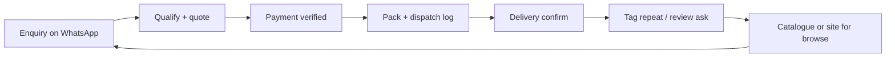

For a huge share of Kenyan SMEs, the real checkout is not a website cart. It is a **WhatsApp thread**: photo, price, "niko na stock?", delivery estate, Till number, "payment sent." That is not a temporary stage before "real digital." It is digital commerce with a chat UI.

This guide treats WhatsApp as a sales channel with process, not as a personal phone that happens to ring with orders. It extends the conversion lessons in [e-commerce storefront launch](/blog/ecommerce-storefront-conversion-launch) and the payment reality in [cashless economy](/blog/what-is-a-cashless-economy) and [embedded finance](/blog/embedded-finance-kenya-guide).

> **Key Insight:** WhatsApp converts because it carries **trust and clarification**. It fails when it carries chaos: mixed personal chats, no price list, no payment proof rule, and no record of what was promised. Professionalise the conversation and you keep the conversion edge without drowning the owner.

```cards
- icon: MessageCircle
  title: Structure the chat
  desc: Business profile, pinned price list, saved replies, and clear operating hours.
  linkText: Storefront conversion
  linkUrl: /blog/ecommerce-storefront-conversion-launch
- icon: Smartphone
  title: Close the payment loop
  desc: Till/Paybill discipline, proof rules, and delivery confirmation.
  linkText: Cashless Kenya
  linkUrl: /blog/what-is-a-cashless-economy
  type: amber
- icon: LineChart
  title: Measure the channel
  desc: Enquiries, paid orders, response time, and repeat rate beat vanity follower counts.
  linkText: SEO and leads
  linkUrl: /blog/sme-seo-inbound-lead-engine
  type: emerald
```

---

### What WhatsApp Is Good At (and Bad At)

| Strength | Weakness |
|---|---|
| High trust, low friction questions | Hard to search old promises |
| Photo and voice clarification | Owner becomes the bottleneck |
| Natural upsell and bundling | Inconsistent pricing if unscripted |
| Works on low-end phones | Weak catalogue browsing at scale |
| Easy repeat orders | Fraud and fake payment screenshots |

Use WhatsApp for **demand capture and high-touch close**. Use a storefront, price list PDF, or simple site for **browse and proof** when the catalogue grows ([storefront case](/blog/ecommerce-storefront-conversion-launch)).

---

### Channel Setup Checklist

1. **WhatsApp Business** (not only personal app features) with business name, hours, address or service area, and catalogue if useful.
2. **Profile photo and short description** that state what you sell and where you deliver.
3. **Pinned welcome message**: who you are, price list link, order format, payment methods, delivery cut-off times.
4. **Separate business number** when volume justifies it; stop mixing family groups with customer rage about a late parcel.
5. **Labels or simple CRM tags**: New, Quoted, Paid, Packed, Delivered, Follow-up.
6. **Saved replies** for price, delivery fees, lead times, and payment instructions.

---

### Offer Architecture in Chat

Customers should not need seven messages to learn the basics.

**Standard order template** (ask them to copy):

```text
Name:
Item + size/qty:
Delivery area:
Preferred time:
Payment method:
```

**Price honesty:**

- Publish a list (PDF, catalogue, or status highlights) and keep chat for exceptions.
- State when prices change (commodity items) so you do not argue mid-thread.
- Quote delivery as a line item, not a surprise at the gate.

**Bundles:** WhatsApp is ideal for "buy X get delivery free above KES Y" because you can explain it in one voice note. Keep the rule written so staff do not freestyle discounts into bankruptcy ([margin discipline](/blog/sme-packager-optimization)).

---

### Payments and Proof (Non-Negotiable)

Kenyan chat commerce dies on **payment ambiguity**.

| Rule | Why |
|---|---|
| One primary Till/Paybill stated in the welcome message | Stops wrong-number fraud |
| Payment before dispatch for new customers (or deposit rules) | Reduces fake orders |
| Verify in the actual merchant app/SMS, not screenshot alone | Fake receipts exist |
| Order ID or customer name as payment reference | Reconciliation |
| Receipt back to customer with items and delivery ETA | Trust and fewer disputes |

Broader payment context: [cashless economy](/blog/what-is-a-cashless-economy), [embedded finance](/blog/embedded-finance-kenya-guide).

For COD or pay-on-delivery zones, cap ticket size and geography; the storefront case study kept POD as a trust bridge for first orders, then migrated repeats to prepay.

---

### Response SLA and Staffing

Speed sells on WhatsApp. Silence sells for your competitor.

| Stage | Target habit |
|---|---|
| First response | Minutes in business hours, not "tomorrow if I remember" |
| Quote completeness | Price + availability + delivery in one message where possible |
| After payment | Confirmation + packing/dispatch update |
| After delivery | One follow-up for issues and repeat |

When volume grows:

- Daytime duty roster
- Shared playbook for discounts
- Escalation to owner only for exceptions
- Avoid a single unlocked phone with every customer thread and every OTP for banking ([risk management](/blog/sme-risk-management-kenya))

---

### From Chat Chaos to Light Systems



Minimum records (sheet is enough at first):

| Date | Customer | Items | Amount | Pay ref | Status | Source (Status/Ad/Referral) |
|---|---|---|---|---|---|---|

That sheet is how you learn which Status posts and referrals pay. It is the same measurement spirit as [website traffic without enquiries](/blog/website-traffic-zero-enquiries): activity is not revenue.

---

### When to Add a Real Storefront

Keep pure WhatsApp when:

- SKU count is small
- Orders are high-touch or custom
- Trust depends on conversation

Add a storefront or structured catalogue when:

- Customers ask the same catalogue questions all day
- You need broader discovery beyond your contacts ([SEO engine](/blog/sme-seo-inbound-lead-engine))
- Staff cannot keep prices straight in free text
- You want analytics on drop-off ([storefront launch](/blog/ecommerce-storefront-conversion-launch))

Pattern that works in Kenya: **browse elsewhere, close on WhatsApp**, or **pay on site, support on WhatsApp**. Do not force a false choice.

---

### Risk Factors

- **Account bans or device loss** without export/backup of important threads and contacts.
- **Staff fraud** (redirecting Tills, pocketing COD).
- **Personal data** in chats; be careful what you pin and forward.
- **Over-discounting** under chat pressure.
- **Platform rule changes** for bulk messaging and Business API tools.
- **This is education**, not a WhatsApp Business API implementation manual.

---

### Decision Framework: 7-Day Professionalisation

**Day 1:** Install/complete WhatsApp Business profile; write welcome message.  
**Day 2:** Publish price list; create order template.  
**Day 3:** Payment verification SOP; one Till only.  
**Day 4:** Saved replies for top 10 questions.  
**Day 5:** Labels + simple order sheet.  
**Day 6:** Response hours posted; backup admin if possible.  
**Day 7:** Review: paid orders, average response time, top stuck questions.

Then decide whether the next shilling goes to ads, a catalogue upgrade, or a storefront.

---

### Bengula View

The desk's view is that WhatsApp is not "unprofessional." Unprofessional is **undocumented commerce**. Kenyan customers already chose the channel. Winning firms respect that choice and add structure: clear offers, verified payments, measurable fulfilment, and a path to systems when chat volume earns them.

Do not abandon WhatsApp to look modern. Modernise WhatsApp until the data tells you which pieces deserve a storefront, a call centre tool, or a formal Business API setup.

For conversion architecture beyond chat, read [e-commerce storefront launch](/blog/ecommerce-storefront-conversion-launch). For lead flow from search, read [SME SEO](/blog/sme-seo-inbound-lead-engine). For hands-on channel design, use [services](/services) or [book a session](/contact).

---

### Sources and Further Reading

- Bengula Inc: [E-commerce Storefront & Conversion Launch](/blog/ecommerce-storefront-conversion-launch), [What Is a Cashless Economy](/blog/what-is-a-cashless-economy), [Embedded Finance in Kenya](/blog/embedded-finance-kenya-guide), [SME SEO Inbound Lead Engine](/blog/sme-seo-inbound-lead-engine), [Website Traffic, Zero Enquiries](/blog/website-traffic-zero-enquiries), [SME Risk Management](/blog/sme-risk-management-kenya).

*General digital commerce education for Kenyan SMEs, not platform, legal, or payments-compliance advice. WhatsApp features and business rules change; verify current terms in the app and official Meta business documentation.*
